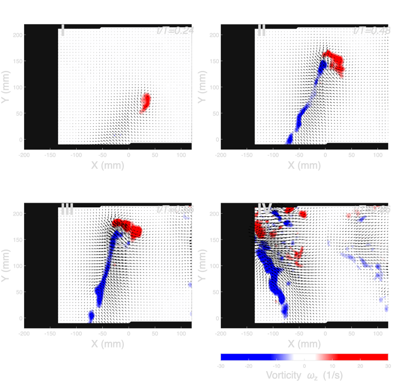

# Caleb Young  
# Mechanical Engineering Student | Experimental Fluids Research Lab | Mechanical Design

## About Me
I am a mechanical engineering student with hands-on experience in experimental fluid dynamics, mechanical design, and system/data analysis. I love working on projects that involve design and iteration.

# Projects
# Experimental Fluids Research – PIV Analysis
**Role:** Experimental design, data processing, analysis  
- Designed and fabricated experimental fixtures  
- Conducted PIV measurements and flow visualization  
- Processed velocity and vorticity fields in MATLAB  

*PIV experimental setup showing blade mounting and laser alignment.*

*Mini40 force sensor integration on blade.*

*Custom 3D-printed mount for Mini40 force sensor.*

*Instantaneous vorticity fields from PIV analysis.*

*Circulation computed from PIV-derived velocity fields using trapezoidal integration in MATLAB.*

[Download previous research summary (PDF)](pdfs/Previous%20Research%20Experience.pdf)

[Download USP proposal (PDF)](pdfs/USP%20Proposal.pdf)

### Mechanical Design Project
**Role:** CAD, fabrication, iteration  
- Designed mechanical assemblies with real-world constraints  
- Considered tolerances, load paths, and manufacturability  

---

## Skills
- CAD: SolidWorks, Fusion 360  
- Analysis: MATLAB, Python  
- Manufacturing: 3D printing, prototyping  
- Fluids: PIV, experimental methods

---

## Contact
- Email: cj@teamyoung.net
- Mobile: 360-901-6486
- GitHub: https://github.com/cyoung604
- LinkedIn: www.linkedin.com/in/caleb-young-7583732b3
