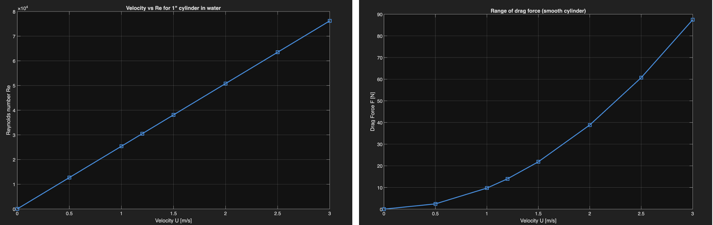

Force sensor 

## Experimental Setup & Methods
- **Model:** 1:4 scale rowing paddle tested in a 24" × 24" × 24" quiescent water tank  
- **Flow similarity:** Reynolds number Re ≈ 2.2 × 10⁴  
- **Velocity scaling:** κ = u₍experiment₎ / u₍scaled₎ = 0.5 (selected due to facility constraints)  
- **Force/torque sensing:** ATI Mini40 6-axis force/torque sensor  
- **Post-processing:** V

- ## Deliverables
- [Previous research summary (PDF)](../pdfs/Previous%20Research%20Experience.pdf)  
- [USP proposal (PDF)](../pdfs/USP%20Proposal.pdf)

## Tools
Python • Zaber • 3D printing (MakerBot Sketch)

*ATI Mini40 force sensor integrated with the rowing blade assembly.*

*Custom 3D-printed mount designed to interface the Mini40 sensor with submerged test hardware.*

*Cylindrical rod mounted to a linear stage for controlled drag-force calibration experiments.*

## Force Sensor Validation

*Measured drag force on a cylindrical rod versus velocity (0–3 m/s), compared against analytical predictions using literature drag coefficients.*

## Deliverables
- [Previous research summary (PDF)](../pdfs/Previous%20Research%20Experience.pdf)  
- [USP proposal (PDF)](../pdfs/USP%20Proposal.pdf)

