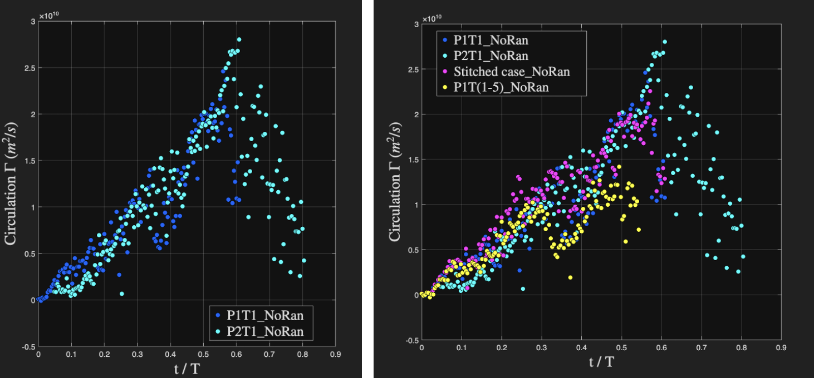

# Experimental Fluids Research: PIV Analysis of Rowing Blades

## Objective
## Objective
Quantify how adding a RANDALLfoil blade attachment changes the surrounding flow structures, and correlate those flow features with measured forces/torques to evaluate the attachment’s claimed performance benefits.

## My Role
- Experimental fixture design and fabrication
- PIV data collection and flow visualization
- MATLAB post-processing (velocity, vorticity, circulation)

## Setup & Methods
- **Model + facility:** 1:4 scale rowing paddle tested in a 24" × 24" × 24" quiescent tank
- **Flow similarity:** Reynolds number Re ≈ 2.2 × 10^4.
- **Velocity scaling:** κ = u_experiment / u_scaled = 0.5 (selected due to setup limits).
- **PIV measurement:** Mid-chord plane illuminated with a 532 nm continuous-wave laser sheet; LaVision MX 2M-160 camera
- **Force/torque sensing:** mini 40 Force sensor
- **Post-processing:** Velocity → vorticity fields; circulation computed from PIV-derived velocity fields (trapezoidal integration in MATLAB).

## Setup and Initial Results

*PIV experimental setup showing blade mounting and laser alignment.*

*Mini40 force sensor integration on blade.*

*Custom 3D-printed mount for Mini40 force sensor.*

*Instantaneous vorticity fields from PIV analysis.*

*Circulation computed from PIV-derived velocity fields using trapezoidal integration in MATLAB.*

## Deliverables
- [Previous research summary (PDF)](../pdfs/Previous%20Research%20Experience.pdf)
- [USP proposal (PDF)](../pdfs/USP%20Proposal.pdf)

## Tools
DaVis • MATLAB • (add Python if relevant) • SolidWorks/Fusion 360 • 3D printing

